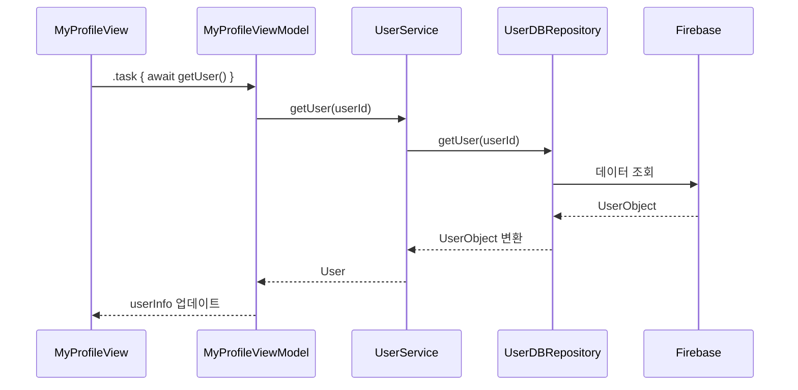

## 1. SwiftUI 프로젝트에서 `UserDBRepository`, `UserService`, `ViewModel` 계층의 역할과 사용법

## 목차
1. **`UserDBRepository`와 `UserService`의 개념 및 역할**
2. **계층을 나눈 이유**
3. **데이터 모델(User vs UserObject)의 차이점**
4. **비즈니스 로직 정의와 예시**
5. **Mermaid 다이어그램**
6. **코드 예시**

## UserDBRepository
`UserDBRepository`는 데이터베이스에 직접적으로 접근하는 계층이다.  
Firebase Realtime Database와 같은 외부 데이터베이스와의 통신을 담당하며, 데이터 추가 ,조회, 업데이트, 삭제 등의 CRUD 작업을 제공한다

#### 주요 역할
- **Firebase와의 직접 통신:** Firebase 데이터베이스를 호출하여 데이터를 가져오거나 저장한다.
- **데이터 변환:** 앱의 모델 데이터를 JSON 형식으로 변환하거나, 데이터베이스에서 가져온 데이터를 앱에서 사용할 수 있는 모델로 변환한다.
- **비동기 처리:** Combine이나 async/await를 통해 비동기 작업을 처리한다

#### 코드 예시
``` swift
func getUser(userId: String) async throws -> UserObject {
    guard let value = try await self.db.child(DBKey.Users).child(userId).getData().value else {
        throw DBError.emptyValue
    }
    let data = try JSONSerialization.data(withJSONObject: value)
    return try JSONDecoder().decode(UserObject.self, from: data)
}
```

---

### UserService
`UserService`는 앱의 비즈니스 로직을 담당하며, 뷰모델(ViewModel)과 데이터베이스 리포지토리(Repository) 사이의 중간 계층 역할을 한다. `UserDBRepository`에서 데이터를 가져와 가공하거나, 데이터를 업데이트 하기 전에 추가적인 로직을 처리한다.

#### 주요 역할
- **비즈니스 로직 처리:** Repository에서 데이터를 가져온 후 추가적인 가공 또는 검증 로직을 수행한다.
- **모델 변환:** 앱에서 사용하는 데이터 모델(User)와 데이터베이스 객체(UserObject)간의 변환을 수행한다.
- **의존성 주입:** Repository를 주입받아 느슨한 결합(Lose Coupling)을 유지한다.

## 2. `UserDBRepository`, `UserService` 계층을 나눈 이유
1. **책임 분리**
    - `UserDBRepository`는 데이터베이스에 직접 통신하는 역할을, `UserService`는 비즈니스 로직 처리를 담당한다. 
    - 데이터베이스와 비즈니스 로직 간의 의존성을 줄여 각각 독립적으로 개발, 수정이 가능하다
2. **테스트 용이성**
    - `UserService`는 데이터베이스와 독립적으로 동작하므로, 단위 테스트에서 Mock이나 Stub을 사용해 테스트하기 용이하다.
3. **유연성 확보**
    - 데이터베이스가 Firebase에서 다른 데이터베이스로 변경되더라도 `UserDBRepository`만 수정하면 된다.
    - `UserService`와 `ViewModel`은 변경에 영향을 받지 않는다.


## 3. 앱에서 사용하는 데이터 모델(User)과 데이터베이스 객체(UserObject)차이
**UserObject:**   
- 데이터베이스와 직접적으로 관련된 구조이다. 데이터베이스에 저장하거나 가져오는 형태로 디자인되어있다.
- 데이터베이스와의 의존성이 있는 구조체로, 데이터 저장 형식(JSON, Dictionary등)에 최적화되어있다.
- 예를 들어 Firebase Realtime Database는 Json 기반으로 데이터를 저장하므로, UserObject는 이러한 데이터 포멧을 고려한 구조를 가진다.     
- ex) Double 타입으로 변환된 createdAt 값을 사용.    

```swift
// 데이터베이스와 통신하기 위해 설계된 데이터 모델
// 데이터베이스(Firebase 등)의 JSON 형식에 맞게 데이터를 저장하거나 읽어오기 위해 존재
// 단순하고 직렬화 가능(Codable)하도록 설계 
// -> Codable 프로토콜을 사용해 JSON과 UserObject 간 변환을 쉽게 처리
struct UserObject: Codable {
    var id: String
    var name: String
    var description: String
    var createdAt: Double // Firebase timestamp
}
```

**User**  
- 앱 내부에서 사용되는 모델로, UI와 비즈니스 로직에 맞게 설계되어 있다. 
- 데이터베이스와 무관하며, 앱의 화면 및 로직 처리에 필요한 형태와 속성을 가진다.
- ex) Date 타입으로 변환된 createdAt 값을 사용.  

```swift 
// UserObject에는 없는 추가적인 계산이나 데이터를 포함할 수 있다
// ex) 사용자 이름을 "Mr. DongHyeon Kim"형태로 가공하여 표시 가능
struct User {
    var id: String
    var name: String
    var description: String
    var createdAt: Date // Swift의 Date 객체
}
``` 

---

## 차이점 요약
1. **책임 분리**
   - `UserObject`는 데이터베이스와 통신하며, `User`는 앱의 비즈니스 로직 및 UI에 사용된다.
2. **유연성과 확장성**
   - 데이터베이스 변경 시 `UserObject`만 수정하면 되고, `User`는 변경되지 않는다.
3. **타입 안정성**
   - JSON 데이터를 다루는 `UserObject`는 Firebase와의 호환성을, `User`는 앱에서의 타입 안전성을 보장한다.

---

## 4. 비즈니스 로직 정의와 예시

### 비즈니스 로직이란?
**비즈니스 로직**은 소프트웨어에서 특정 도메인의 요구사항을 처리하기 위한 규칙, 절차, 계산, 데이터 처리 및 제약 조건을 정의하고 실행하는 코드이다.

- **역할**:
  - 단순 데이터 저장 및 읽기 이상의 추가 처리(가공, 검증 등)를 담당.
  - 특정 도메인의 요구사항을 반영하여 데이터를 처리.

---

### UserService에서의 비즈니스 로직 예시

#### 예 1: 사용자 상태 메시지 검증
사용자가 상태 메시지를 입력할 때 길이가 140자를 초과하지 않도록 제한.
```swift
func validateStatusMessage(_ message: String) -> Bool {
    return message.count <= 140
}
```

#### 예 2: Firebase 시간 데이터를 로컬 시간으로 변환
Firebase에서 저장된 UTC 시간을 사용자의 로컬 시간으로 변환.
```swift
func convertToUserLocalTime(utcTimestamp: Double) -> Date {
    let date = Date(timeIntervalSince1970: utcTimestamp)
    let userTimeZone = TimeZone.current
    let secondsFromGMT = userTimeZone.secondsFromGMT(for: date)
    return date.addingTimeInterval(Double(secondsFromGMT))
}
```

#### 예 3: 데이터 업데이트 로직
상태 메시지를 업데이트하기 전에 비즈니스 검증 로직을 추가.
```swift
func updateDescription(userId: String, description: String) async throws {
    guard validateStatusMessage(description) else {
        throw ValidationError.invalidMessage
    }
    try await dbRepository.updateUser(userid: userId, key: "description", value: description)
}
```

---


## 5. Mermaid 다이어그램


### 6. 코드 예시
#### 데이터 모델 변환
```swift
extension UserObject {
    func toModel() -> User {
        return User(
            id: self.id,
            name: self.name,
            description: self.description,
            createdAt: Date(timeIntervalSince1970: self.createdAt)
        )
    }
}

extension User {
    func toObject() -> UserObject {
        return UserObject(
            id: self.id,
            name: self.name,
            description: self.description,
            createdAt: self.createdAt.timeIntervalSince1970
        )
    }
}
```

---

## 결론
`UserDBRepository`와 `UserService`는 데이터베이스와 비즈니스 로직을 명확히 분리하여 코드의 유지보수성과 확장성을 높인다.  
비즈니스 로직은 데이터를 검증하거나 변환하여 UI와 사용자 경험의 품질을 보장한다.
